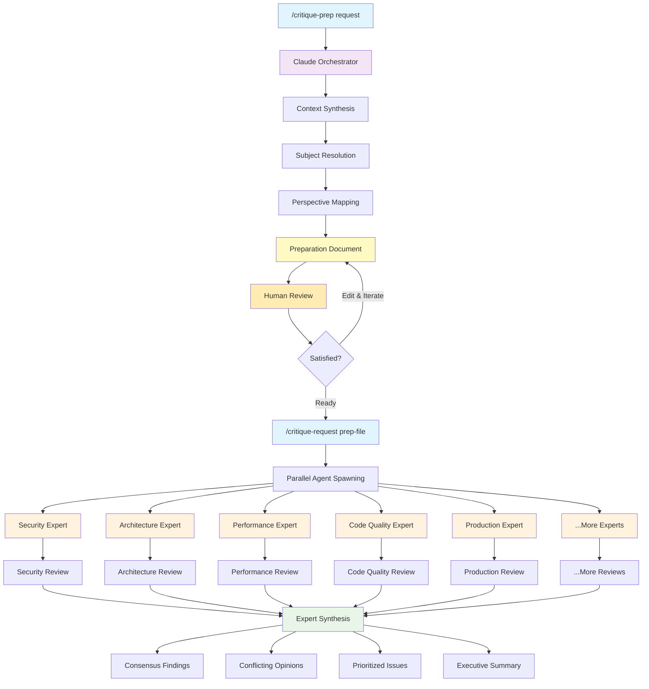

# Critique Workflow Guide

## Overview

The critique workflow uses **two specialized commands** that trigger an **agentic workflow** for comprehensive code and plan analysis:
- `/critique-prep` - Prepare critique execution with human review
- `/critique-request` - Execute critique based on finalized preparation

This two-phase approach provides human oversight of critical context synthesis and perspective mapping before spawning AI agents.

## What Does It Do?



**Key Value**: Human oversight of context synthesis and perspective mapping ensures critique agents receive precisely framed problems, while parallel expert analysis catches blind spots and reduces bias.

## Features

### 🔍 **Dual Critique Categories**
- **Detect Problems**: Hunt for issues, anti-patterns, security risks, over-engineering
- **Assess Excellence**: Evaluate what's working well - architecture, performance, code quality

### ⚡ **Two-Phase Workflow**
- **Phase 1**: Preparation with human review of context and perspective mapping
- **Phase 2**: Parallel expert analysis with synthesis
- Full transparency of exact prompts sent to agents

### 🎯 **Intelligent Subject Resolution**
- Automatically finds relevant files when you mention concepts
- Includes git changes if you reference "recent changes"
- Understands context from natural language descriptions

### 📊 **Structured Output**
- Preparation documents in `critique-prep/` for human review
- Individual expert reports saved to `reviews/` directory
- Synthesis report highlighting agreements, disagreements, and priorities
- Complete orchestrator prompt documentation for transparency

## Two-Phase Workflow

### Phase 1: Preparation (`/critique-prep`)
**Purpose**: Context synthesis, subject resolution, and human review

1. **Context Analysis** - Extract project vision, constraints, and decision rationale
2. **Subject Resolution** - Intelligently find relevant files and scope
3. **Perspective Mapping** - Map user request to available expert prompts
4. **Preparation Document** - Generate human-reviewable execution plan
5. **Human Review** - Edit context, scope, or prompts before execution

### Phase 2: Execution (`/critique-request`)
**Purpose**: Parallel expert analysis using finalized preparation

1. **Validation** - Ensure preparation document is complete and current
2. **Agent Spawning** - Launch Task agents with exact prompts from preparation
3. **Parallel Analysis** - Multiple expert perspectives work simultaneously
4. **Synthesis** - Combine findings into prioritized, actionable insights

**Key Benefit**: You control exactly how the problem is framed for expert agents.

## Sync Commands

To sync the critique commands and prompts to another project, use this prompt with Claude Code:

```
Please fetch and sync these files from the claude-code-power-pack public repo to my local .claude directory:

1. .claude/commands/critique-prep.md
2. .claude/commands/critique-request.md
2. All files from .claude/prompts/detect-problem/
3. All files from .claude/prompts/assess-excellence/

Use the Task tool with curl to download each file from:

**Commands:**
- https://raw.githubusercontent.com/cmardiros/claude-code-power-pack/main/.claude/commands/critique-prep.md
- https://raw.githubusercontent.com/cmardiros/claude-code-power-pack/main/.claude/commands/critique-request.md
- https://raw.githubusercontent.com/cmardiros/claude-code-power-pack/main/.claude/commands/plan_review_revise.md

**Detect Problem Prompts:**
- https://raw.githubusercontent.com/cmardiros/claude-code-power-pack/main/.claude/prompts/detect-problem/detect-problem-anti-patterns.md
- https://raw.githubusercontent.com/cmardiros/claude-code-power-pack/main/.claude/prompts/detect-problem/detect-problem-blindspots.md
- https://raw.githubusercontent.com/cmardiros/claude-code-power-pack/main/.claude/prompts/detect-problem/detect-problem-future-regrets.md
- https://raw.githubusercontent.com/cmardiros/claude-code-power-pack/main/.claude/prompts/detect-problem/detect-problem-junior-mistakes.md
- https://raw.githubusercontent.com/cmardiros/claude-code-power-pack/main/.claude/prompts/detect-problem/detect-problem-over-engineering.md
- https://raw.githubusercontent.com/cmardiros/claude-code-power-pack/main/.claude/prompts/detect-problem/detect-problem-premortem-failures.md
- https://raw.githubusercontent.com/cmardiros/claude-code-power-pack/main/.claude/prompts/detect-problem/detect-problem-smells.md
- https://raw.githubusercontent.com/cmardiros/claude-code-power-pack/main/.claude/prompts/detect-problem/detect-problem-veteran-latest.md

**Assess Excellence Prompts:**
- https://raw.githubusercontent.com/cmardiros/claude-code-power-pack/main/.claude/prompts/assess-excellence/assess-excellence-architectural.md
- https://raw.githubusercontent.com/cmardiros/claude-code-power-pack/main/.claude/prompts/assess-excellence/assess-excellence-code.md
- https://raw.githubusercontent.com/cmardiros/claude-code-power-pack/main/.claude/prompts/assess-excellence/assess-excellence-future-value.md
- https://raw.githubusercontent.com/cmardiros/claude-code-power-pack/main/.claude/prompts/assess-excellence/assess-excellence-performance.md
- https://raw.githubusercontent.com/cmardiros/claude-code-power-pack/main/.claude/prompts/assess-excellence/assess-excellence-premortem.md
- https://raw.githubusercontent.com/cmardiros/claude-code-power-pack/main/.claude/prompts/assess-excellence/assess-excellence-production.md
- https://raw.githubusercontent.com/cmardiros/claude-code-power-pack/main/.claude/prompts/assess-excellence/assess-excellence-security.md
- https://raw.githubusercontent.com/cmardiros/claude-code-power-pack/main/.claude/prompts/assess-excellence/assess-excellence-testing.md
- https://raw.githubusercontent.com/cmardiros/claude-code-power-pack/main/.claude/prompts/assess-excellence/assess-excellence-veteran.md

Use the Task tool to run curl commands like:
curl -s "https://raw.githubusercontent.com/cmardiros/claude-code-power-pack/main/.claude/commands/critique-prep.md"

Then use Write to save each file to the corresponding path in my local .claude directory, creating the directories if they don't exist. Please maintain the exact file structure and content.
```

---

## Available Perspectives

### Detect Problems
- `anti-patterns` - Identify common anti-patterns and code smells
- `blindspots` - Find overlooked issues and missing considerations
- `future-regrets` - Spot decisions that may cause future problems
- `junior-mistakes` - Catch common beginner errors
- `over-engineering` - Identify unnecessary complexity
- `premortem-failures` - Anticipate potential failure points
- `smells` - Detect various code and design smells

### Assess Excellence
- `architectural` - Evaluate system design and architecture
- `code` - Assess code quality and craftsmanship
- `future-value` - Analyze long-term value and extensibility
- `performance` - Review performance characteristics
- `premortem` - Proactive success planning
- `production` - Production readiness assessment
- `security` - Security posture evaluation
- `testing` - Test coverage and quality
- `veteran` - Senior developer perspective

## Detailed Workflow

### Preparation Phase (`/critique-prep`)

#### 1. **Context Analysis & Subject Resolution**
- **File references**: Searches plans/, src/, docs/ for matching files
- **Recent changes**: Includes git diff of uncommitted changes  
- **Concept references**: Finds related files using keywords
- **Project context**: Extracts vision, constraints, and decision rationale with **"think super hard"** approach

#### 2. **Perspective Extraction & Intent Clarification**
- Extracts specific perspective names and categories from user input
- For detect-problem: identifies specific concerns (e.g., "security-vulnerabilities", "performance-bottlenecks")
- For assess-excellence: identifies excellence domains (e.g., "architectural", "security")
- Handles ambiguous language by inferring most likely specific perspectives
- Detects critique type: plan review, implementation assessment, or current state analysis

#### 3. **Preparation Document Generation**
- Saves preparation document to `critique-prep/{subject}-critique-prep-v1.md`
- Includes requested perspectives with intent descriptions
- Adds special instructions for plan file focus, implementation review, or current state analysis
- Provides review guidelines for human evaluation

### Execution Phase (`/critique-request`)

#### 1. **Preparation Validation & Intelligent Perspective Mapping**
- Verifies preparation document format and completeness
- Checks that referenced files still exist
- **Intelligently maps** perspective names to best matching prompt files:
  - Maps specific concerns to appropriate detect-problem prompts
  - Maps excellence domains to appropriate assess-excellence prompts
  - Handles generic names by inferring category-specific mapping
- Validates all mapped perspectives have corresponding prompt files

#### 2. **Parallel Agent Spawning with Context-Aware Instructions**
Each perspective spawns a dedicated Task agent that:
1. Receives context and subject from preparation document
2. Gets **contextual instructions** based on critique type:
   - **Plan File Focus**: "READ PLAN FILE CAREFULLY" for plan critiques
   - **Implementation Review**: Compare against original intent/plan
   - **Current State Analysis**: Broad assessment of existing codebase
3. Reads specialized perspective prompt file
4. Analyzes relevant files with "think super hard" depth
5. Generates structured critique following prompt framework
6. Saves individual report to `reviews/` directory

#### 3. **Expert Synthesis**
After all agents complete:
1. Aggregates all expert findings
2. Identifies **consensus vs. conflicting opinions**
3. Highlights **common themes** across perspectives
4. Prioritizes issues by severity and cross-expert agreement
5. Generates executive summary with concrete recommendations

## Usage Examples

### Use Case 1: Plan Critique
```bash
# Step 1: Prepare critique for plan analysis
/critique-prep "detect problems and assess excellence for architecture in our logging infrastructure plan"

# Step 2: Review preparation document - ensures plan file reading emphasis
# Edit critique-prep/logging-infrastructure-plan-critique-prep-v1.md if needed

# Step 3: Execute when satisfied
/critique-request critique-prep/logging-infrastructure-plan-critique-prep-v1.md
```

### Use Case 2: Implementation Review
```bash
# Step 1: Prepare implementation assessment
/critique-prep "assess recent authentication implementation changes for security and performance issues"

# Step 2: Review preparation - focuses on implementation vs. intent comparison
# Edit critique-prep/authentication-implementation-critique-prep-v1.md if needed

# Step 3: Execute focused implementation review
/critique-request critique-prep/authentication-implementation-critique-prep-v1.md
```

### Use Case 3: Current State Assessment
```bash
# Step 1: Prepare comprehensive current state analysis
/critique-prep "comprehensive assessment of our current codebase architecture and security posture"

# Step 2: Review preparation - ensures broad current state analysis scope
# Edit critique-prep/codebase-assessment-critique-prep-v1.md if needed

# Step 3: Execute comprehensive assessment
/critique-request critique-prep/codebase-assessment-critique-prep-v1.md
```

### Mixed Perspectives Example
```bash
/critique-prep "detect problems related to overengineering, assess excellence for simplicity look at the logging infrastructure plan"
/critique-request critique-prep/logging-infrastructure-plan-critique-prep-v1.md
```

## Output Structure

### Preparation Phase
- **Preparation document**: `critique-prep/{subject_name}-critique-prep-v1.md`

### Execution Phase
- **Individual critiques**: `reviews/{subject_name}-{perspective}-v1.md`
- **Synthesis report**: `reviews/{subject_name}-synthesis-v1.md`
- **Orchestrator prompts**: `reviews/{subject_name}-orchestrator-prompt-v1.md`
- **Metadata tracking**: Timestamp, prompt template, clarified subject

### Human Review Process

After `/critique-prep` generates the preparation document:

1. **Review Context**: Does the synthesized context accurately capture project constraints and rationale?
2. **Verify Scope**: Is the critique subject and scope precisely defined?
3. **Check Perspectives**: Are the selected perspectives appropriate with clear intent descriptions?
4. **Validate Special Instructions**: Are the right contextual instructions included (plan file focus, implementation review, etc.)?
5. **Assess Critique Purpose**: Is the overall purpose clearly articulated?
6. **Edit as Needed**: Modify context, perspectives, or instructions before execution
7. **Execute**: Run `/critique-request` when satisfied with the preparation

This human oversight ensures critique agents receive precisely framed problems with appropriate context that will produce relevant, actionable insights for your specific use case.