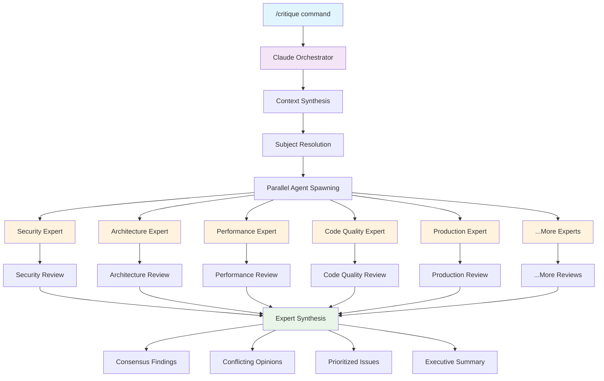

# Critique Workflow Guide

## Overview

The `/critique` command is a **specialized prompt** that triggers an **agentic workflow** for comprehensive code and plan analysis. It orchestrates multiple AI agents to simultaneously examine your code from different expert perspectives, then synthesizes their findings into actionable insights.

## What Does It Do?



**Key Value**: Multiple expert perspectives working in parallel catch blind spots, reduce bias, and synthesize insights that single reviews miss.

## Features

### 🔍 **Dual Critique Categories**
- **Detect Problems**: Hunt for issues, anti-patterns, security risks, over-engineering
- **Assess Excellence**: Evaluate what's working well - architecture, performance, code quality

### ⚡ **Parallel Expert Analysis** 
- Multiple AI agents work simultaneously (not sequentially)
- Each agent specializes in one perspective (security, performance, etc.)
- Automatic synthesis shows consensus vs. conflicting opinions

### 🎯 **Intelligent Subject Resolution**
- Automatically finds relevant files when you mention concepts
- Includes git changes if you reference "recent changes"
- Understands context from natural language descriptions

### 📊 **Structured Output**
- Individual expert reports saved to `reviews/` directory
- Synthesis report highlighting agreements, disagreements, and priorities
- Metadata tracking for reproducibility

## How Slash Commands Work

**Slash commands are specialized prompts** that trigger sophisticated agentic workflows. When you type `/critique`, you're not just asking Claude a question - you're launching an orchestrated system where:

1. **The main Claude acts as an orchestrator** - understanding your request and coordinating sub-agents
2. **Task agents are spawned** - each with specialized expertise and specific instructions
3. **Agents work in parallel** - multiple analyses happen simultaneously 
4. **Results are synthesized** - the orchestrator combines findings into actionable insights

This is fundamentally different from a simple chat - it's like having Claude manage a team of AI consultants for you.

## Sync Commands

To sync the `/critique` command and its prompts to another project, use this prompt with Claude Code:

```
Please fetch and sync these files from the claude-code-power-pack public repo to my local .claude directory:

1. .claude/commands/critique.md
2. All files from .claude/prompts/detect-problem/
3. All files from .claude/prompts/assess-excellence/

Use the Task tool with curl to download each file from:
- https://raw.githubusercontent.com/cmardiros/claude-code-power-pack/main/.claude/commands/critique.md
- https://raw.githubusercontent.com/cmardiros/claude-code-power-pack/main/.claude/prompts/detect-problem/detect-problem-anti-patterns.md
- https://raw.githubusercontent.com/cmardiros/claude-code-power-pack/main/.claude/prompts/detect-problem/detect-problem-blindspots.md
- https://raw.githubusercontent.com/cmardiros/claude-code-power-pack/main/.claude/prompts/detect-problem/detect-problem-future-regrets.md
- https://raw.githubusercontent.com/cmardiros/claude-code-power-pack/main/.claude/prompts/detect-problem/detect-problem-junior-mistakes.md
- https://raw.githubusercontent.com/cmardiros/claude-code-power-pack/main/.claude/prompts/detect-problem/detect-problem-over-engineering.md
- https://raw.githubusercontent.com/cmardiros/claude-code-power-pack/main/.claude/prompts/detect-problem/detect-problem-premortem-failures.md
- https://raw.githubusercontent.com/cmardiros/claude-code-power-pack/main/.claude/prompts/detect-problem/detect-problem-smells.md
- https://raw.githubusercontent.com/cmardiros/claude-code-power-pack/main/.claude/prompts/assess-excellence/assess-excellence-architectural.md
- https://raw.githubusercontent.com/cmardiros/claude-code-power-pack/main/.claude/prompts/assess-excellence/assess-excellence-code.md
- https://raw.githubusercontent.com/cmardiros/claude-code-power-pack/main/.claude/prompts/assess-excellence/assess-excellence-future-value.md
- https://raw.githubusercontent.com/cmardiros/claude-code-power-pack/main/.claude/prompts/assess-excellence/assess-excellence-performance.md
- https://raw.githubusercontent.com/cmardiros/claude-code-power-pack/main/.claude/prompts/assess-excellence/assess-excellence-premortem.md
- https://raw.githubusercontent.com/cmardiros/claude-code-power-pack/main/.claude/prompts/assess-excellence/assess-excellence-production.md
- https://raw.githubusercontent.com/cmardiros/claude-code-power-pack/main/.claude/prompts/assess-excellence/assess-excellence-security.md
- https://raw.githubusercontent.com/cmardiros/claude-code-power-pack/main/.claude/prompts/assess-excellence/assess-excellence-testing.md
- https://raw.githubusercontent.com/cmardiros/claude-code-power-pack/main/.claude/prompts/assess-excellence/assess-excellence-veteran.md

Use the Task tool to run curl commands like:
curl -s "https://raw.githubusercontent.com/cmardiros/claude-code-power-pack/main/.claude/commands/critique.md"

Then use Write to save each file to the corresponding path in my local .claude directory, creating the directories if they don't exist. Please maintain the exact file structure and content.
```

---

## Available Perspectives

### Detect Problems
- `anti-patterns` - Identify common anti-patterns and code smells
- `blindspots` - Find overlooked issues and missing considerations
- `future-regrets` - Spot decisions that may cause future problems
- `junior-mistakes` - Catch common beginner errors
- `over-engineering` - Identify unnecessary complexity
- `premortem-failures` - Anticipate potential failure points
- `smells` - Detect various code and design smells

### Assess Excellence
- `architectural` - Evaluate system design and architecture
- `code` - Assess code quality and craftsmanship
- `future-value` - Analyze long-term value and extensibility
- `performance` - Review performance characteristics
- `premortem` - Proactive success planning
- `production` - Production readiness assessment
- `security` - Security posture evaluation
- `testing` - Test coverage and quality
- `veteran` - Senior developer perspective

## Workflow Behind the Scenes

### 1. **Context Analysis & Subject Resolution**
The orchestrator synthesizes project context from your input and intelligently resolves what to critique:
- **File references**: Searches plans/, src/, docs/ for matching files
- **Recent changes**: Includes git diff of uncommitted changes  
- **Concept references**: Finds related files using keywords
- **Project context**: Extracts vision, constraints, and decision rationale to guide critiques

### 2. **Parallel Agent Spawning**
Each perspective spawns a dedicated Task agent that:
1. Receives project context and critique subject
2. Reads specialized perspective prompt (detect-problem-security.md, assess-excellence-architectural.md, etc.)
3. Analyzes relevant files with "think super hard" depth
4. Generates structured critique following prompt framework
5. Saves individual report to `reviews/` directory

### 3. **Expert Synthesis**
After all agents complete, the orchestrator:
1. Aggregates all expert findings
2. Identifies **consensus vs. conflicting opinions**
3. Highlights **common themes** across perspectives
4. Prioritizes issues by severity and cross-expert agreement
5. Generates executive summary with concrete recommendations

## Usage Examples

### Problem Detection
```bash
/critique "detect problems for security, performance in the auth implementation"
```

### Excellence Assessment
```bash
/critique "assess excellence for architecture, assess excellence for performance analyze the new API design"
```

### Mixed Perspectives
```bash
/critique "detect problems related to overengineering, assess excellence for simplicity look at the logging infrastructure plan"
```

### Recent Changes Analysis
```bash
/critique "detect problems for security review the recent authentication changes"
```

## Output Structure

- **Individual critiques**: `reviews/{subject_name}-{perspective}-v1.md`
- **Synthesis report**: `reviews/{subject_name}-synthesis-v1.md`
- **Metadata tracking**: Timestamp, prompt template, clarified subject

Each output includes structured analysis following the specific perspective's framework, ensuring consistent and actionable feedback across all critique types.