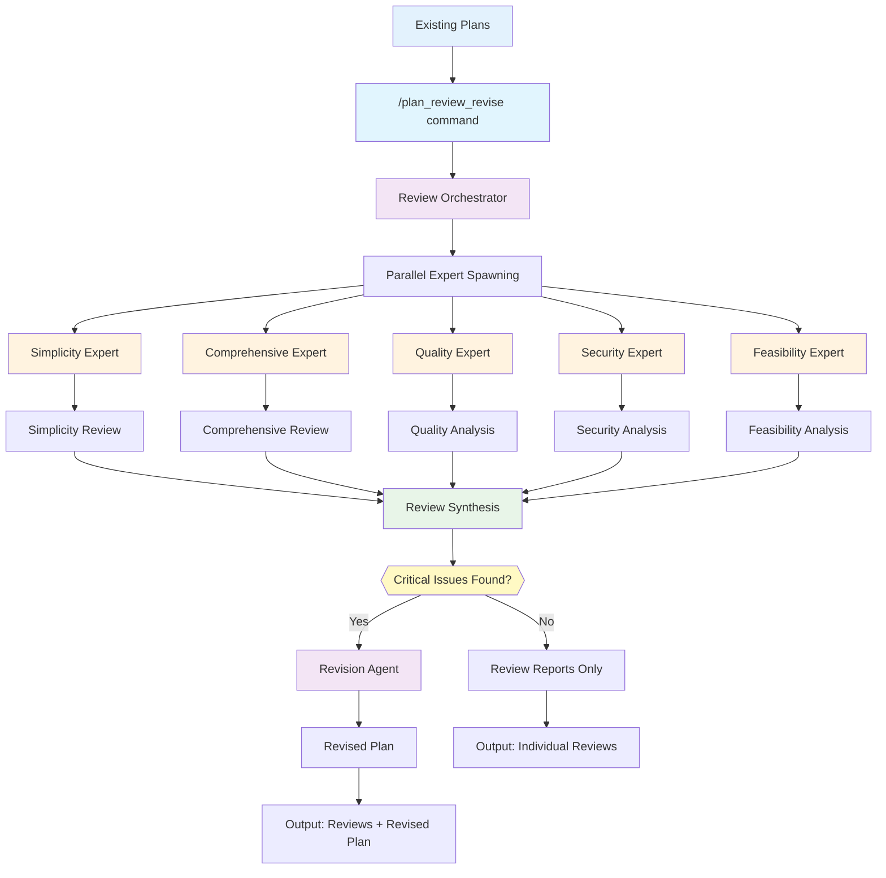

# Plan Review & Revise Workflow Guide

## Overview

The `/plan_review_revise` command is a **specialized prompt** that triggers an **agentic workflow** for reviewing and refining existing implementation plans. It takes your existing plans, orchestrates multiple expert review agents to analyze them from different perspectives, then optionally revises the plans when critical issues are found.

## What Does It Do?



**Key Value**: Takes your existing plans and provides expert-level quality assurance through parallel review perspectives, automatically revising when critical issues are found.

## Features

### 🔍 **Multi-Perspective Review**
- **Simplicity Expert**: Focuses on complexity reduction, clarity, over-engineering detection
- **Comprehensive Expert**: Multi-layered QA validation covering security, feasibility, maintainability
- Each expert applies specialized frameworks with configurable thinking depth

### ⚡ **Parallel Expert Analysis**
- Multiple review agents work simultaneously (not sequentially)
- Automatic plan resolution from natural language (e.g., "my plan", "API plan")
- Intelligent synthesis identifies critical issues requiring revision

### 🧠 **Configurable Thinking Budget**
- **"think hard"**: Quick analysis for familiar domains
- **"think super hard"**: Balanced analysis for production plans (default)
- **"ultrathink"**: Maximum analysis for critical systems

### 🔄 **Intelligent Revision**
- Automatically generates improved plans when critical issues found
- Preserves core objectives while addressing identified concerns
- Maintains plan structure and adds versioning

## How Slash Commands Work

**Slash commands are specialized prompts** that trigger sophisticated agentic workflows. When you type `/plan_review_revise`, you're launching an orchestrated system where:

1. **The main Claude acts as an orchestrator** - parsing your request and coordinating specialist review agents
2. **Task agents are spawned** - each with specific review expertise (simplicity, comprehensive analysis, etc.)
3. **Agents work in parallel** - following specialized review frameworks with configurable thinking depth
4. **Results are synthesized** - outputs are combined to identify critical issues and generate revisions when needed

This creates a **systematic quality assurance process** for your existing plans rather than ad-hoc reviews.

## Sync Commands

To sync the `/plan_review_revise` command and its prompts to another project, use this prompt with Claude Code:

```
Please fetch and sync these 3 files from the claude-code-power-pack public repo to my local .claude directory:

1. .claude/commands/plan_review_revise.md
2. .claude/prompts/reviews/comprehensive_review.md  
3. .claude/prompts/reviews/simplicity_review.md

Use the Task tool with curl to download each file from:
- https://raw.githubusercontent.com/cmardiros/claude-code-power-pack/main/.claude/commands/plan_review_revise.md
- https://raw.githubusercontent.com/cmardiros/claude-code-power-pack/main/.claude/prompts/reviews/comprehensive_review.md
- https://raw.githubusercontent.com/cmardiros/claude-code-power-pack/main/.claude/prompts/reviews/simplicity_review.md

Use the Task tool to run curl commands like:
curl -s "https://raw.githubusercontent.com/cmardiros/claude-code-power-pack/main/.claude/commands/plan_review_revise.md"

Then use Write to save each file to the corresponding path in my local .claude directory, creating the directories if they don't exist. Please maintain the exact file structure and content.
```

---

## How It Works

### Parallel Processing
When multiple plans or perspectives are specified, reviews run in parallel for faster results.

### Thinking Budget Levels
- **"think hard"** - Quick reviews for familiar domains and straightforward plans
- **"think super hard"** - Balanced analysis for production plans (default)
- **"ultrathink"** - Maximum analysis for critical systems and high-risk changes

### Review Perspectives
- **Simplicity** - Focuses on complexity reduction, clarity, over-engineering detection
- **Comprehensive** - Quality standards, security, feasibility, risk identification

### Natural Language Parsing
The system supports natural language input but has limitations. If parsing fails (too fuzzy), fall back to keyword syntax.

### Output Files
- Review analyses saved to `plan-reviews/`: `[plan-name]-v1-[perspective]-review.md`
- Revised plans saved to `plans/`: `[plan-name]-v1-revised.md`

## Prerequisites

**Plans must exist before review**. Ask Claude to create your implementation plan and save it in the `/plans/` folder. Follow prompt engineering best practices.

**Best Practice**: Version your plans (e.g., `logging-infrastructure-plan-v1.md`) to track review and revision cycles.

## How to Use

### Basic Usage

**Keyword Syntax:**
```bash
/plan_review_revise PLANS="my-plan.md" REVIEW_PERSPECTIVES="comprehensive" THINKING_BUDGET="think super hard"
```

**Natural Language Equivalent:**
```bash
/plan_review_revise review my-plan comprehensively and think super hard
```

### Multiple Plans and Perspectives

**Keyword Syntax:**
```bash
/plan_review_revise PLANS="plan1.md,plan2.md" REVIEW_PERSPECTIVES="simplicity,comprehensive" THINKING_BUDGET="ultrathink"
```

**Natural Language Equivalent:**
```bash
/plan_review_revise review plan1.md and plan2.md using both perspectives ultrathink mode
```

### Custom Output Location

**Keyword Syntax:**
```bash
/plan_review_revise PLANS="my-plan.md" REVIEW_PERSPECTIVES="simplicity" OUTPUT_DIR="plan-reviews/sprint-15"
```

**Natural Language Equivalent:**
```bash
/plan_review_revise review my-plan.md for simplicity save to plan-reviews/sprint-15
```

## Examples (Using Dummy `logging-infrastructure-plan.md`)

### Quick Simplicity Check

**Keyword:**
```bash
/plan_review_revise PLANS="logging-infrastructure-plan.md" REVIEW_PERSPECTIVES="simplicity" THINKING_BUDGET="think hard"
```

**Natural Language:**
```bash
/plan_review_revise review the logging infrastructure plan using simplicity perspective and think hard
```

### Comprehensive Analysis

**Keyword:**
```bash
/plan_review_revise PLANS="logging-infrastructure-plan.md" REVIEW_PERSPECTIVES="comprehensive" THINKING_BUDGET="think super hard"
```

**Natural Language:**
```bash
/plan_review_revise analyze the logging infrastructure plan comprehensively and think super hard
```

### Maximum Analysis (Both Perspectives)

**Keyword:**
```bash
/plan_review_revise PLANS="logging-infrastructure-plan.md" REVIEW_PERSPECTIVES="simplicity,comprehensive" THINKING_BUDGET="ultrathink"
```

**Natural Language:**
```bash
/plan_review_revise review logging infrastructure plan both perspectives ultrathink mode
```

### Quick Test Commands
You can try these immediately with the existing plan:

```bash
/plan_review_revise review the logging infrastructure plan for simplicity and think hard
/plan_review_revise analyze logging infrastructure plan comprehensively think super hard  
/plan_review_revise review logging-infrastructure-plan both perspectives ultrathink
```
